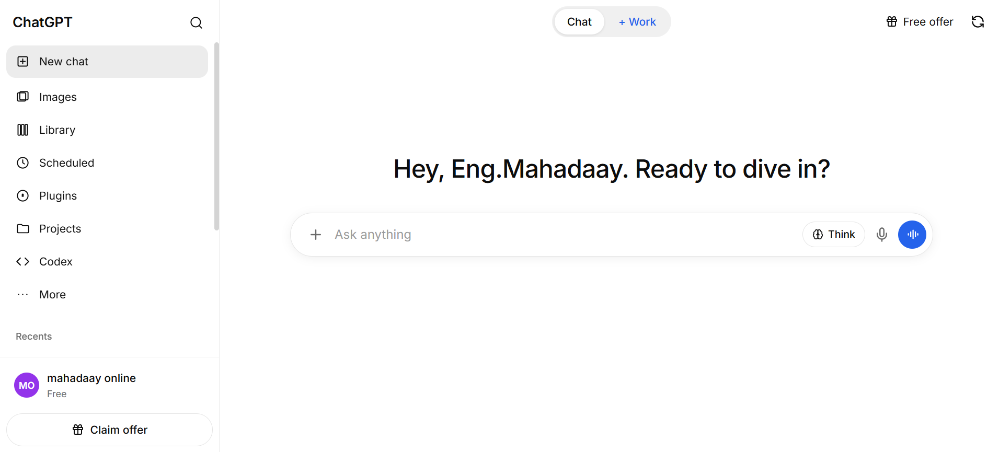

# 🤖 ChatGPT UI Clone — React

A modern and responsive **ChatGPT-inspired AI chat interface** built with **React.js**.

This project focuses on recreating the look and user experience of a modern AI chatbot platform, including conversations, sidebar navigation, chat messages, and a clean responsive interface.

> **Note:** This project is currently a **frontend UI project**. It does not include a real AI backend or OpenAI API integration.

---
## 👇 Public Url
https://chatgpt-clone-amber-beta.vercel.app/

## ✨ Features

* 💬 ChatGPT-inspired chat interface
* 📱 Fully responsive design
* 🗂️ Conversation/sidebar navigation
* 📝 User and AI message layout
* 🎨 Modern and clean UI
* ⚡ Fast React + Vite development
* 🔄 New conversation interface
* 🌙 Modern dark/light interface
* 📋 Message action buttons
* 🔍 Chat history interface
* 🖥️ Desktop and mobile friendly

---

## 🛠️ Technologies

* **React.js**
* **Vite**
* **JavaScript (ES6+)**
* **CSS3**
* **HTML5**
* **React Icons**

---

## 📂 Project Structure

```text
chatgpt-clone/
│
├── public/
│
├── src/
│   ├── assets/
│   ├── App.css
│   ├── App.jsx
│   ├── index.css
│   └── main.jsx
│
├── .gitignore
├── package.json
├── package-lock.json
├── vite.config.js
└── README.md
```

---

## 🚀 Getting Started

### 1. Clone the repository

```bash
git clone https://github.com/Engmahadaay/chatgpt-clone.git
```

### 2. Navigate to the project

```bash
cd chatgpt-clone
```

### 3. Install dependencies

```bash
npm install
```

### 4. Start the development server

```bash
npm run dev
```

The application will normally be available at:

```text
http://localhost:5173
```

---

## 📸 Screenshots



## 🔮 Future Improvements

The following features can be added in future versions:

* 🤖 Real AI API integration
* 🔐 User authentication
* 💾 Persistent chat history
* 🗄️ Database integration
* 🎤 Voice input
* 📎 File upload
* 🖼️ Image upload
* 🌐 Multi-language support
* 🌓 Dark/Light mode
* 🧠 AI model selection
* 🗑️ Delete conversations
* ✏️ Rename conversations

---

## 🎯 Project Purpose

The main purpose of this project is to practice and demonstrate modern **React frontend development**, component-based architecture, responsive UI design, and the development of an AI-chat application interface.

It can also serve as a starting point for building a complete AI assistant application by connecting it to a backend and AI API.

---

## 👨‍💻 Author

**Eng.Mahadaay**

Software Developer & Computer Science Engineer

---

## 📄 License

This project is created for **educational and development purposes**.

Feel free to use, modify, and improve the project.
